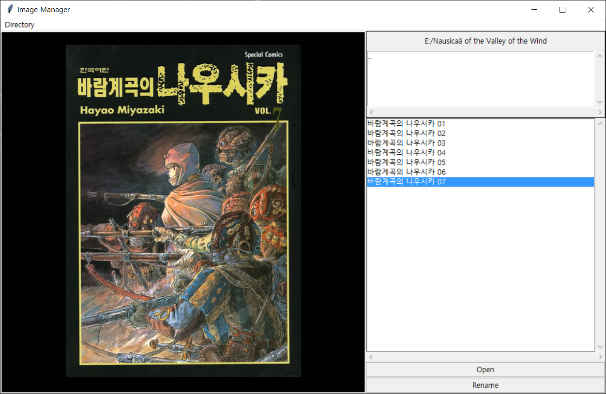
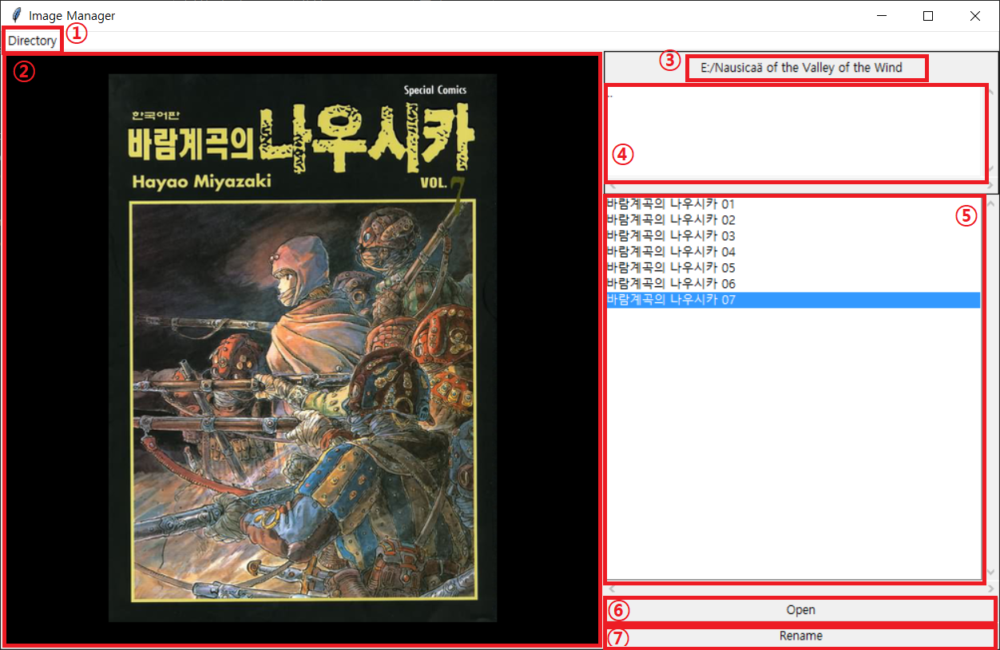
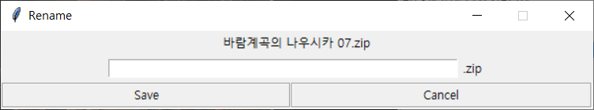
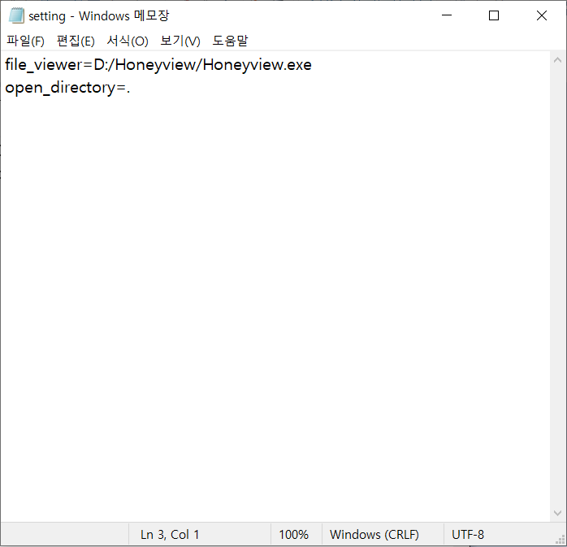

# Image Manager

## 만든 이유 / The reason why I maked it
압축파일로 된 만화의 경우 이름으로만 내용을 추론해야 하기에 관리하기 쉽지 않다.\
그렇기에 어떻게 하면 압축파일로 된 만화들을 한 눈에 파악하고 관리할 수 있을지 고민했고, 그 결과 이와 같은 GUI 프로그램을 Python을 이용해 만들게 되었다.\
물론 많은 기능을 지원하지는 않는다.\
그러나 다 똑같이 보이는 압축파일을 미리보기로 파악할 수 있는 것만 해도 꽤 도움이 되었다고 생각한다.

## 제작 방식 / How I maked it
- pyqt를 이용하면 더 좋았겠지만, 투박하지만 빠르게 만들 수 있는 tkinder를 선택해 제작했다.

- Class를 적극적으로 활용해 메인 스크립트에 여러 모듈을 붙이는 식으로 하지 않고,
  하나의 메인 스크립트 안에 모든 코드를 집어넣었다.\
  이것은 아직까지 Class 활용이 능숙하지 않은 탓도 있고,
  tkinter패키지를 처음 사용해보기에 어떻게 하면 Class를 활용하며 여러 기능을 구현할 수 있을지 감이 없었던 탓도 있다.\
  아마 시간을 더 들인다면 더 세련된 코드로 작성할 수 있을 것이라 생각하지만 시간관계 상 여기에서 멈추는 게 낫다고 판단했다.

## 기능 / Function

- ① 새 디렉토리 : 새로운 디렉토리로 이동할 수 있다.
- ② 미리보기 : 이미지 미리보기가 뜨는 곳.
- ③ 현재 디렉토리 : 현재 디렉토리를 표시한다.
- ④ 하부 디렉토리 리스트: 현재 디렉토리의 하부 디렉토리를 표시한다. 더블 클릭 시 해당 디렉토리로 이동한다.
- ⑤ 파일 리스트 : 현재 디렉토리 내 이미지 및 zip 파일을 표시한다. 더블 클릭 시 해당 파일 오픈한다.
- ⑥ 열기 버튼 : ⑤에서 선택한 파일을 오픈한다.
- ⑦ 이름 바꾸기 버튼 : ⑤에서 선택한 파일의 이름을 변경할 수 있는 창이 뜬다.   

## 설정 / Setting

- file_viewer: 외부 뷰어를 이용해 파일을 열 때, 어떤 뷰어를 이용해 열 것인지 정해 주기 위한 것이다.\
꿀뷰를 이용한 열기를 상정하고 만들었기 때문에 기본은 꿀뷰로 되어 있다.

- open_directory: 메뉴의 Directory -> Open_Dir을 통해 새 디렉토리를 설정할 때 어느 부분에서 탐색을 시작할 것인가를 정해 주기 위한 것이다.\
보면 알 수 있듯이 기본은 main.py가 있는 디렉토리로 설정되어 있다.

이처럼 설정을 완료한 후, main.py와 setting.txt를 같은 디렉토리에 두고 실행하면 된다.

  .text-red on white

